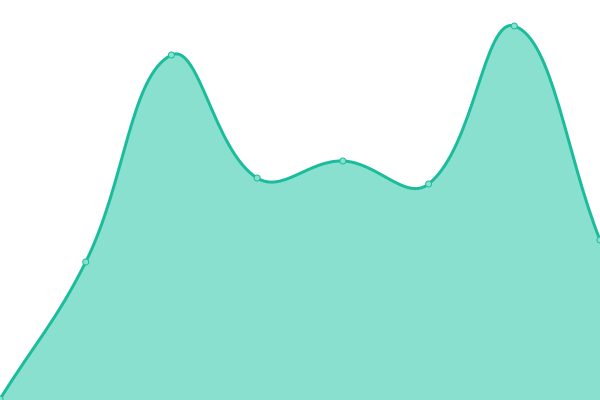

# [📈 Live Status](https://ranapnea.github.io/upptime): <!--live status--> **🟧 Partial outage**

This repository contains the open-source uptime monitor and status page for [Antti Rantanen](https://ranapnea.github.io/upptime), powered by [Upptime](https://github.com/upptime/upptime).

With [Upptime](https://upptime.js.org), you can get your own unlimited and free uptime monitor and status page, powered entirely by a GitHub repository. We use [Issues](https://github.com/ranapnea/upptime/issues) as incident reports, [Actions](https://github.com/ranapnea/upptime/actions) as uptime monitors, and [Pages](https://ranapnea.github.io/upptime) for the status page.

<!--start: status pages-->
<!-- This summary is generated by Upptime (https://github.com/upptime/upptime) -->
<!-- Do not edit this manually, your changes will be overwritten -->
<!-- prettier-ignore -->
| URL | Status | History | Response Time | Uptime |
| --- | ------ | ------- | ------------- | ------ |
|  [Google](https://www.google.com) | 🟩 Up | [google.yml](https://github.com/ranapnea/upptime/commits/HEAD/history/google.yml) | 

 103ms
     
 | 

<a href="https://ranapnea.github.io/upptime/history/google">100.00%</a>
    

|  [SWYE -api](https://swye.app/v1/service-health-check) | 🟩 Up | [swye-api.yml](https://github.com/ranapnea/upptime/commits/HEAD/history/swye-api.yml) | 

 255ms
     
 | 

<a href="https://ranapnea.github.io/upptime/history/swye-api">100.00%</a>
    

|  [LifeSystem](http://life-system.app/) | 🟥 Down | [life-system.yml](https://github.com/ranapnea/upptime/commits/HEAD/history/life-system.yml) | 

 0ms
     
 | 

<a href="https://ranapnea.github.io/upptime/history/life-system">0.00%</a>
    

|  [TimeStack - web](https://timestack.cc) | 🟩 Up | [time-stack-web.yml](https://github.com/ranapnea/upptime/commits/HEAD/history/time-stack-web.yml) | 

 1913ms
     
 | 

<a href="https://ranapnea.github.io/upptime/history/time-stack-web">100.00%</a>
    

|  [TimeStack -api](https://timestack.cc/v1/service-health-check) | 🟥 Down | [time-stack-api.yml](https://github.com/ranapnea/upptime/commits/HEAD/history/time-stack-api.yml) | 

 171ms
     
 | 

<a href="https://ranapnea.github.io/upptime/history/time-stack-api">0.00%</a>
    

|  [EasyBp](https://easybp.app) | 🟩 Up | [easy-bp.yml](https://github.com/ranapnea/upptime/commits/HEAD/history/easy-bp.yml) | 

 965ms
     
 | 

<a href="https://ranapnea.github.io/upptime/history/easy-bp">95.74%</a>
    

|  [Mindly](https://www.mindlyapp.com) | 🟥 Down | [mindly.yml](https://github.com/ranapnea/upptime/commits/HEAD/history/mindly.yml) | 

 0ms
     
 | 

<a href="https://ranapnea.github.io/upptime/history/mindly">0.00%</a>
    

|  [Histories - api](https://histories.pro/api/v1/service-health-check) | 🟥 Down | [histories-api.yml](https://github.com/ranapnea/upptime/commits/HEAD/history/histories-api.yml) | 

 0ms
     
 | 

<a href="https://ranapnea.github.io/upptime/history/histories-api">0.00%</a>
    

|  [Histories - site](https://histories.pro/site/service-health-check) | 🟥 Down | [histories-site.yml](https://github.com/ranapnea/upptime/commits/HEAD/history/histories-site.yml) | 

 0ms
     
 | 

<a href="https://ranapnea.github.io/upptime/history/histories-site">0.00%</a>
    

|  [Failing Test Site](https://timestack.cc/nothing-here) | 🟥 Down | [failing-test-site.yml](https://github.com/ranapnea/upptime/commits/HEAD/history/failing-test-site.yml) | 

 146ms
     
 | 

<a href="https://ranapnea.github.io/upptime/history/failing-test-site">0.00%</a>
    

<!--end: status pages-->

[**Visit our status website →**](https://ranapnea.github.io/upptime)

## 📄 License

- Powered by: [Upptime](https://github.com/upptime/upptime)
- Code: [MIT](./LICENSE) © [Antti Rantanen](https://ranapnea.github.io/upptime)
- Data in the `./history` directory: [Open Database License](https://opendatacommons.org/licenses/odbl/1-0/)
